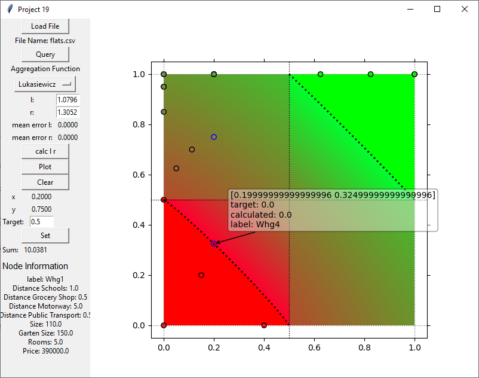
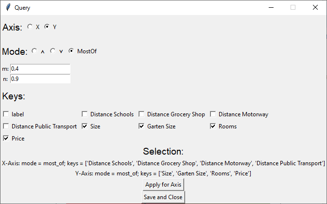
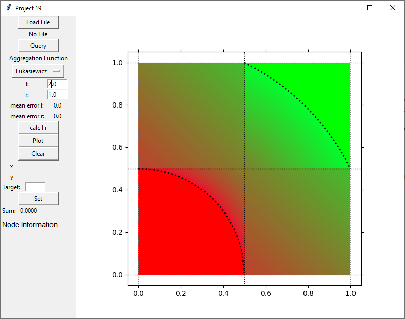
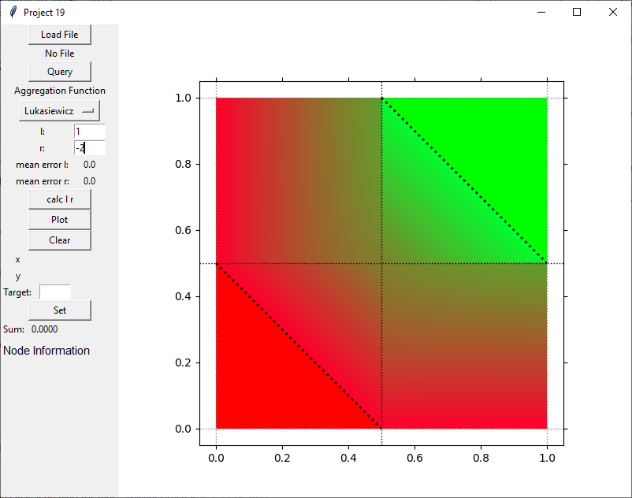
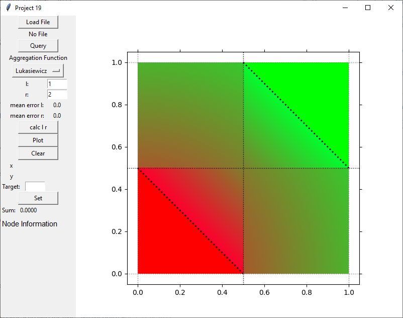
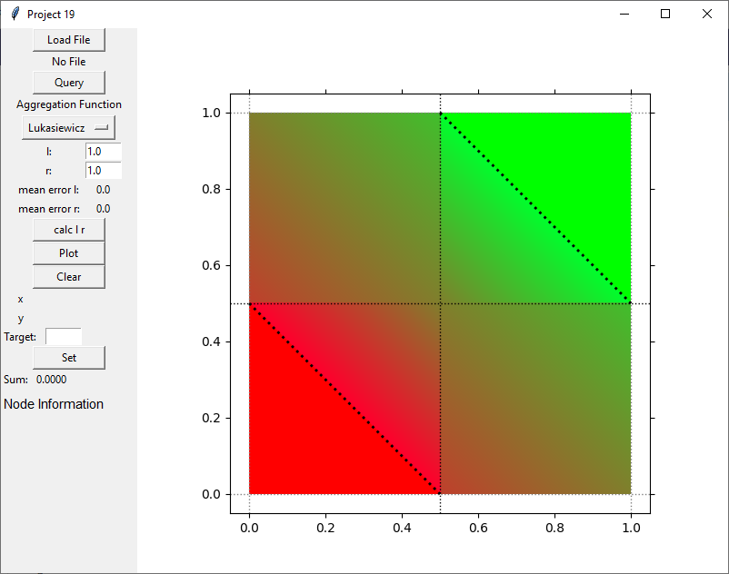

# Classification into classes by aggregation functions of mixed behaviour

## AK HCAI Mini Projects (Class of 2021) - Mini Project 19 
A project for the course https://human-centered.ai/lv-706-046-ak-hci-2021-hcai/

## Related Publications

## Introduction
This project implements the theoretical approaches described in "Related Publications" section and provides a set of example data sets.

## Quickstart Guide

### File Structure
This application uses .csv files as data describtor. The separator used is a comma (",").
Additional, the file must have following structure:
* **Row 1**: comma separated list of all attributes of the data points. 
_Note: for easier node identification in plots the first attribute can be used as label by naming it "label"_
* **Row 2**: comma seperated list of following structure "DL1|DH1, ... , DLn|DHn" where DLi describes the value which should be rated most negativ and DHi rated most positiv for the corresponding attribute. 
_Note: if DLi > DHi the application uses the inverse values the corresponding attribute._
* **Row 3-n**: comma separated list of numeric values.  
_Note: if row 1 contains the label option the first element does not have to be a numeric value._

Examples files can be found in "demo_files"

### Plot
The plot is segmented into 4 sections. In the lower left there is the left section and is further split into 2 parts. Values below the curve will strictly be marked as no (0) whereas values above the curve will have a value greater 0.
In the upper right is the yes section. This is again split into 2 parts where above the curve the values will be strict yes (1) and values below the curve are smaller 1.
The maybe fields in the upper left and lower right show data points which are calculated by the maybe functions.
The exact result of the plot depends on the used aggregation and quantifier function.

### Loading Data
Files structured as described in **File Structure** section can be loaded using the "Load File" Button. After loading the raw data a transformation to the space of aggregation functions is performed using DL and DH.

### Defining Quantifier functions
Clicking the "Query" button opens a new window that allows the user to define the quantifier function for each axis. 

The steps to define quantifier functions are:
1. Select target axis
2. Select quantifier function
    * conjunctive
    * disjunctive
    * most-of
3. In case of "most-of" define m and n
4. Define the keys (attributes) used for the target axis
5. Apply for axis
6. Repeat steps 1-5 for other axis
7. Click "'Save and Close" to apply settings

For more information about quantifier functions please refer to the related publications section.

### Aggregation functions
In the dropdown menu "Aggregation Function" the user can select a desired aggregation function. Currently there are 4 functions implemented and labeled as follows:
* **Lukasiewicz**: implements the Lukasiewicz t–norm and t–conorm
* **MinMax**: implements the MIN and MAX functions
* **TnormTconormGeometric**: implements the product t–norm, probabilistic sum t–conorm and geometric mean
* **TnormTconormArithmetic** implements the  product t–norm, probabilistic sum t–conorm and arithmetic mean

_Please note that currently only the Lukasiewicz t–norm and t–conorm make use the parameters lambda and r_

### Parameter
#### lambda
The value of lambda influences the boundaries of the yes and no sections using the Lukasiewicz t–norm and t–conorm and can be any value greater 0. Adjusting this paramater can be used to make the classifier more or less strict depending on desired outcome. The following images show the results of changing lambda

#### r
The value of r influences the resulting values of the maybe sections. Adjusting this paramater can be used to make the classifier more or less strict with nodes in the maybe sections. The following images show the result of changing r

### Node Information
Each node represents a datapoint from the loaded file. The posisition is defined by the applied quantifier function for both axis and the value of the node is defined by the used aggregation function and its parameters.
Hoovering over a node will show a annotation including:
* the exact position of the node
* if define, a target value for this node
* the value of the node calculated with the selected aggregation function
* the label of the node

A node can be selected by clicking on it. This will show all the attributes of the datapoint in the lower left field of the application. Additionaly the user then can set a desired target value for the node in order to calculated parameters lambda and r.

### Calculate Lambda and r

Using the "calc l r" button will let the application calculate best matching lambda and r values for the dataset. Therefore there must be a target value set for at least 1 datapoint. The application will then finde the best matching values for lambda in range 0 < lambda <= 5 and r in range -2 <= r <= 4. After calucalting the value the application shows the mean error for lambda and r.

## Examples
### Empty Plot
Using the plot function without providing any data will result in an empty plot. This can be used to see how the distribution of the values change when adjusting the aggregation functions or their parameters.

### Flats Dataset
This dataset consists of fictional appartments and contains following attributes:
* Distance to schools
* Distance to grocery shops
* Distance to motorway
* Distance to public transport
* Size of the flat
* Size of the garten
* Number of Romms
* Price of the flat

The following example plot can be reproduced using following parameters:
* apply most-of quantifier (m=0.4 and n=0.9) for x axis using distance-attributes
* apply most-of quantifier (m=0.4 and n=0.9) for y axis using remaining attributes
* draw plot by using Lukasiewicz t–norm and t–conorm

### Revenue Dataset

### Medical Dataset
