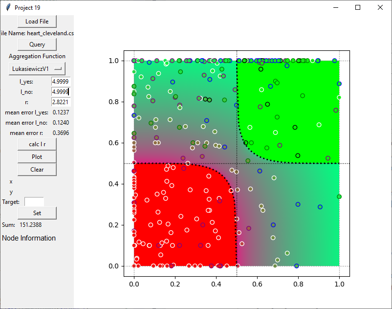

# Classification into classes by aggregation functions of mixed behaviour

## AK HCAI Mini Projects (Class of 2021) - Mini Project 19 
A project for the course [AK HCAI Mini Projects (Class of 2021)](https://human-centered.ai/lv-706-046-ak-hci-2021-hcai/).

## Related Publications
[Classification by ordinal sums of conjunctive and disjunctive functions for explainable AI and interpretable machine learning solutions](https://www.sciencedirect.com/science/article/pii/S0950705121001799?via%3Dihub)

[The axiomatization of asymmetric disjunction and conjunction](https://www.sciencedirect.com/science/article/abs/pii/S1566253518308510)

## Introduction
This project implements the theoretical approaches described in [Related Publications](#related-publications) section and provides a set of example data sets.

## Quickstart Guide

### File Structure
This application uses CSV files as data describtor. The separator used is a comma (",").
Additional, the file must have the following structure:
* **Row 1**: list of all attributes of the data points. 
_Note: for easier node identification in plots the first attribute can be used as label by naming it "label"_
* **Row 2**: list of  the following structure "DL1|DH1, ... , DLn|DHn" where DLi describes the value which should be rated most negatively and DHi rated most positively for the corresponding attribute. 
_Note: if DLi > DHi the application uses the inverse values the corresponding attribute._
* **Row 3-n**: list of numeric values.  
_Note: if row 1 contains the label option the first element does not have to be a numeric value._

Example files can be found in the "examples" folder.

### Plot
The plot is segmented into 4 sections. In the lower left there is the left section and is further split into 2 parts. Values below the curve will strictly be marked as no (0) whereas values above the curve will have a value greater than 0.
In the upper right is the yes section. This is again split into 2 parts where above the curve the values will be strict yes (1) and values below the curve are smaller than 1.
The maybe fields in the upper left and lower right show data points which are calculated by the maybe functions.
The exact result of the plot depends on the used aggregation and quantifier function.

### Loading Data
Files structured as described in [File Structure](#file-structure) section can be loaded using the "Load File" Button. After loading the raw data a transformation to the space of aggregation functions is performed using DL and DH.

### Defining Quantifier functions
Clicking the "Query" button opens a new window that allows the user to define the quantifier function for each axis. 

The steps to define quantifier functions are:
1. Select target axis
2. Select quantifier function
    * conjunctive
    * disjunctive
    * most-of
3. In case of "most-of" define m and n
4. Define the keys (attributes) used for the target axis
5. Apply for axis
6. Repeat steps 1-5 for other axis
7. Click "'Save and Close" to apply settings

For more information about quantifier functions please refer to the [Related Publications](#related-publications) section.

### Aggregation functions
In the dropdown menu "Aggregation Function" the user can select a desired aggregation function. Currently there are 4 functions implemented and labeled as follows:
* **Lukasiewicz**: implements the Lukasiewicz t–norm and t–conorm
* **MinMax**: implements the MIN and MAX functions
* **TnormTconormGeometric**: implements the product t–norm, probabilistic sum t–conorm and geometric mean
* **TnormTconormArithmetic** implements the  product t–norm, probabilistic sum t–conorm and arithmetic mean

_Please note that currently only the Lukasiewicz t–norm and t–conorm make use of the parameters lambda and r_

### Parameter
#### lambda
The value of lambda influences the boundaries of the yes and no sections using the Lukasiewicz t–norm and t–conorm and can be any value greater than 0. Adjusting this paramater can be used to make the classifier more or less strict depending on the desired outcome. The following images show the results of changing lambda:

#### r
The value of r influences the resulting values of the maybe sections. Adjusting this paramater can be used to make the maybe sections more or less strict. The following images show the result of changing r:

### Node Information
Each node represents a datapoint from the loaded file. The position is defined by the applied quantifier function for both axis and the value of the node is defined by the used aggregation function and its parameters.
Hoovering over a node will show an annotation including:
* The exact position of the node.
* If define, a target value for this node.
* The value of the node calculated with the selected aggregation function.
* The label of the node.

A node can be selected by clicking on it. This will show all the attributes of the datapoint in the lower left field of the application. Additionaly the user can set a desired target value for the node in order to calculated parameters lambda and r. More information in the section [Calculate Lambda and r](#calculate-lambda-and-r).

### Calculate Lambda and r

Using the "calc l r" button will let the application calculate best matching lambda and r values for the dataset. Therefore there must be a target value set for at least 1 datapoint. The application will then find the best matching values for lambda in range 0 < lambda <= 5 and r in range -2 <= r <= 4. After that the application shows the mean error for lambda and r.

## Examples
### Empty Plot
Using the plot function without providing any data will result in an empty plot. This can be used to see how the distribution of the values change when adjusting the aggregation functions or their parameters.

### Flats Data Set
This dataset consists of fictional appartments and contains the following attributes:
* Distance to schools
* Distance to grocery shops
* Distance to motorway
* Distance to public transport
* Size of the flat
* Size of the garden
* Number of rooms
* Price of the flat

The following example plot can be reproduced using following parameters:
* Apply most-of quantifier (m=0.4 and n=0.9) for x axis using distance-attributes
* Apply most-of quantifier (m=0.4 and n=0.9) for y axis using remaining attributes
* Draw plot by using Lukasiewicz t–norm and t–conorm

### Revenue Data Set
This dataset consists of fictional sales values and contains the following attributes:
* The sales of a given period
* The average time used per sale

Plotting this data using the Lukasiewicz t–norm and t–conorm results in the following plot:

### Heart Disease Data Set

This example was prepared using the [Cleveland Heart Disease Data Set](https://archive.ics.uci.edu/ml/datasets/Heart+Disease).
In order to properly transform the data to the space of aggregation functions we have made following assumptions:
* age: assuming critical phase starts with 40 and all above 70 is critical
* sex: remains either 0 (female) or 1 (male) and is not used for Plotting
* cp (chest pain type): asymptomatic types (4) are not as critical as typical angina types
* trestbps (resting blood pressure): values above the ideal range (90-120) are rated worse and values above 140 are clear negative
* chol (serum cholestoral in mg/dl): values above the ideal range (200) are rated worse and values above 220 are clear negative
* fbs (fasting blood sugar > 120 mg/dl): 1 is clear negative whereas 0 is clear positively
* restecg (resting electrocardiographic results):
    * Value 0: normal
	* Value 1: having ST-T wave abnormality (T wave inversions and/or ST elevation or depression of > 0.05 mV)
	* Value 2: showing probable or definite left ventricular hypertrophy by Estes' criteria 
* thalach (maximum heart rate achieved): assuming higher values are better and all above 160 is clear positive whereas below 120 is clear negative
* exang (exercise induced angina): 1 is positive and 0 is negative
* oldpeak (ST depression induced by exercise relative): value not used
* slope (slope of the peak exercise ST segment): value not used
* ca (number of major vessels): value not used
* thal: value not used
* num (diagnosis of heart disease): assuming the higher the worst. 0 is positive and 3 clear negative

To reproduce following image:
* apply age for the y axis
* use most-of quantifier with m=0.4 and n=0.8 and attributes cp, trestbps, chol, fbs, restecg, thalach, exang

